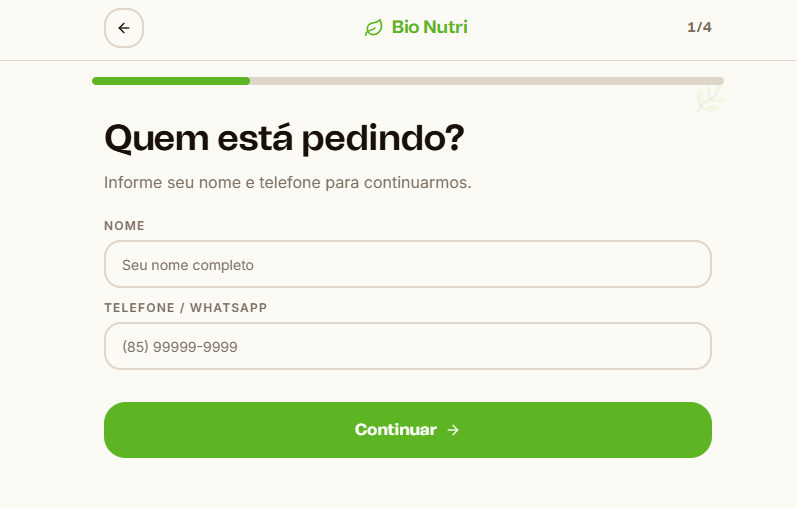
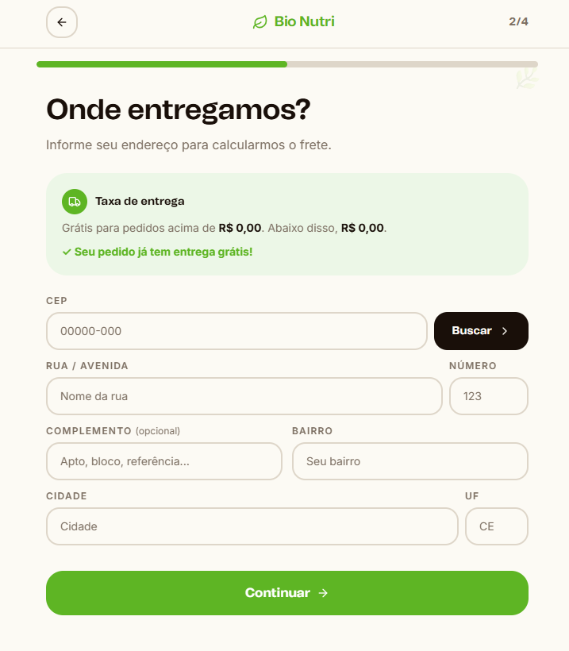
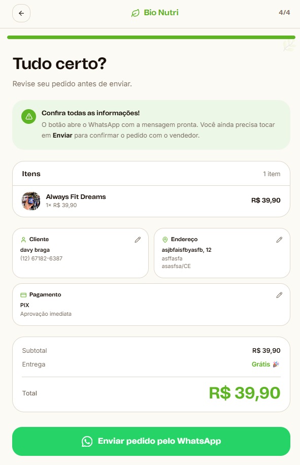

# 🍬 PedeNaHora

<p align="center">
  <strong>Plataforma SaaS multi-tenant que dá a pequenos negócios um catálogo online pronto pra vender, com pedidos caindo direto no WhatsApp da loja.</strong>
</p>

<p align="center">
  
  
  
  
  
</p>

---

## 📌 Sobre o projeto

O **PedeNaHora** é uma plataforma SaaS multi-tenant que dá a pequenos negócios
(docerias, perfumarias, lojas de roupa, suplementos etc.) um catálogo online
pronto pra vender, sem precisar de site próprio.

Projeto pessoal, construído do zero — do checkout do cliente final ao painel
administrativo de cada loja e ao painel de super-admin que gerencia todos os
clientes da plataforma.

Cada loja é um **tenant** com seu próprio slug (`/nome-da-loja`), catálogo,
identidade visual, horário de funcionamento e formas de pagamento — tudo
isolado por `store_id` com Row Level Security no Postgres. O cliente final não
faz login: monta o carrinho, preenche entrega e pagamento no checkout, e o
pedido é formatado automaticamente numa mensagem que abre direto no WhatsApp
da loja.

---

## 🖼️ Screenshots

### 🏠 Landing page


### ✨ Recursos


### 🛒 Checkout guiado (4 passos)

O checkout do cliente final é dividido em passos simples, sem necessidade de
criar conta — termina com o pedido pronto pra enviar pelo WhatsApp da loja.

| 1. Dados do cliente | 2. Entrega |
|---|---|
|  |  |

| 3. Pagamento | 4. Revisão e envio |
|---|---|
|  |  |

---

## ✨ Funcionalidades

- Multi-tenant por slug (`/nome-da-loja`), com isolamento por `store_id` via Row Level Security
- Catálogo público com busca e filtro por categoria
- Carrinho e checkout guiado sem necessidade de login do cliente final
- Pedido formatado automaticamente em mensagem de WhatsApp
- Acompanhamento de pedidos pelo cliente final
- Painel administrativo por loja: produtos, estoque, identidade visual (nome, cores, logo)
- Configuração de PIX e parcelamento por loja
- Horário de funcionamento e fechamento pontual configuráveis
- Upload de imagens com redimensionamento e recompressão automática (via `sharp`)
- Painel de super-admin com visão de todos os clientes da plataforma
- Cadastro de novas lojas e convite de administradores
- Lojas publicáveis/não publicáveis, com badge de "em desenvolvimento" na listagem pública

---

## 🧭 Estrutura de rotas

| Rota | Descrição |
|---|---|
| `/` | Landing page da plataforma — lista as lojas publicadas |
| `/[slug]` | Catálogo público da loja: busca, filtro, carrinho, checkout |
| `/[slug]/checkout` | Checkout guiado (entrega, pagamento, envio ao WhatsApp) |
| `/[slug]/pedidos` | Acompanhamento de pedidos pelo cliente |
| `/admin` | Painel de quem é dono da loja |
| `/admin/produtos` | Gestão de produtos e estoque |
| `/admin/loja` | Dados da loja, identidade visual, horário, pagamento |
| `/superadmin` | Visão geral da plataforma |
| `/superadmin/clientes` | Cadastro e gestão de todas as lojas clientes |
| `/login`, `/cadastro`, `/convite` | Autenticação e convite de administradores |

---

## 🛠️ Tecnologias utilizadas

| Tecnologia | Uso |
|---|---|
| Next.js 16 | Framework web (App Router, Server Actions, Turbopack) |
| React 19 | Biblioteca de interface |
| TypeScript | Tipagem estática |
| Tailwind CSS v4 | Estilização da interface |
| shadcn/radix-ui | Componentes de UI |
| Supabase (Postgres + Auth + RLS) | Banco de dados e autenticação — sem backend separado, a lógica de servidor vive em Server Actions |
| Cloudflare R2 | Armazenamento de imagens (produtos, logos) |
| sharp | Redimensionamento e recompressão automática de imagens no upload |
| React Hook Form + Zod | Formulários e validação |
| TanStack Query | Cache e sincronização de dados no client |
| Git/GitHub | Versionamento |

---

## 🚀 Como rodar o projeto localmente

Clone o repositório:

```bash
git clone https://github.com/DavyPereira/sweetorder_app.git
```

Entre na pasta do projeto:

```bash
cd pedenahora
```

Instale as dependências:

```bash
npm install
```

Configure as variáveis de ambiente:

```bash
cp .env.example .env.local   # preencha com suas chaves (Supabase + R2)
```

Rode o schema do banco (`supabase/schema.sql`) e as migrações incrementais
(`supabase/migration-*.sql`, na ordem) no SQL Editor do seu projeto Supabase.

Inicie o servidor:

```bash
npm run dev
```

Acesse no navegador:

```text
http://localhost:3000
```

### Outros scripts

- `npm run build` / `npm run start` — build e servidor de produção
- `npm run lint` — ESLint
- `npx tsx scripts/reoptimize-images.ts [--dry-run]` — reprocessa imagens já
  hospedadas no R2 (resize + WebP), útil após mudanças na pipeline de upload

---

## 🎨 Identidade visual

O projeto utiliza uma identidade visual baseada em:

- Tons quentes (âmbar/terracota) com verde-sálvia como acento, definidos via `oklch`
- Cada loja pode personalizar sua própria paleta de cores e logo
- Cards arredondados e layout SaaS limpo
- Interface responsiva, pensada mobile-first para o catálogo do cliente final

---

## 📌 Status do projeto

✅ Catálogo público multi-tenant  
✅ Checkout com pedido via WhatsApp  
✅ Painel administrativo por loja  
✅ Painel de super-admin  
✅ Upload e otimização automática de imagens  
✅ Múltiplas lojas em produção (docerias, perfumaria, suplementos, etc.)  
✅ Prints adicionados ao README

---

## 🧭 Próximas melhorias

- Testes automatizados
- Notificações automáticas de status de pedido
- Relatórios e métricas para o painel admin
- Melhorias de responsividade e acessibilidade

---

## 👨‍💻 Autor

Desenvolvido por **Davy Braga**.

<p>
  <a href="https://github.com/DavyPereira">
    
  </a>
</p>
